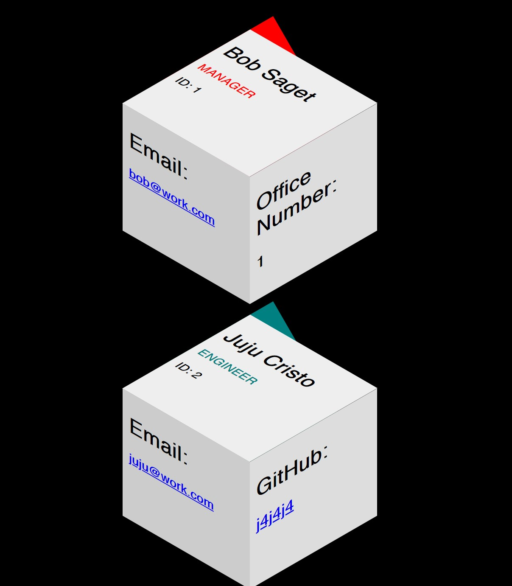
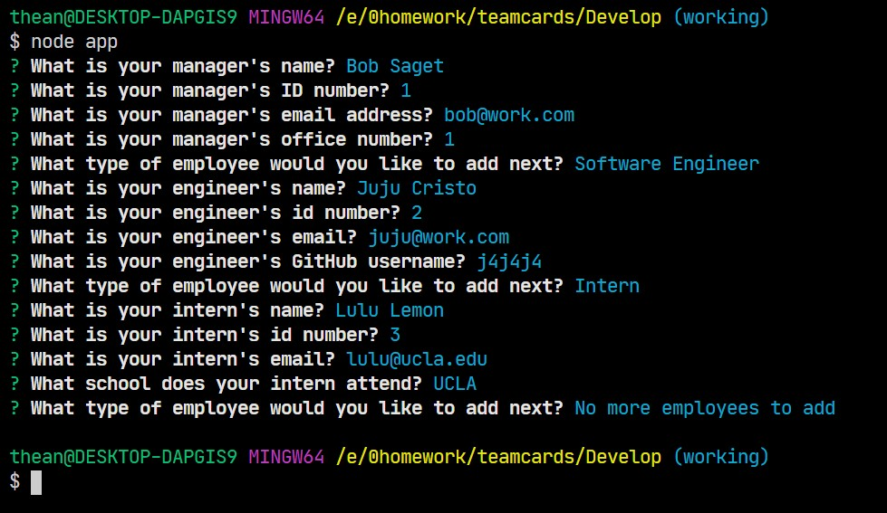

# Employee Card Template Engine

This application uses a simple Node CLI to generate an Employee Cards HTML page for a software engineering team.

## Dependencies and Usage

The application depends on the [Inquirer npm package](https://github.com/SBoudrias/Inquirer.js/), which can be installed with a simple command in the CLI:

```
npm install inquirer
```

The application will prompt the user for information about the team manager and then information about the team members. The user can input any number of team members, and they may be a mix of engineers and interns. When the user has completed building the team, the application will create an HTML file that displays a nicely formatted team roster based on the information provided by the user.

## Functionality:

- The application prompts the user for an email, id, and specific information based on their role with the company. For instance, an intern may provide their school, whereas an engineer may provide their GitHub username.

- The application runs as a Node CLI to gather information about each employee and renders the output in a `team.html` page in the `output` directory that displays a nicely formatted team roster. Each team member displays the following in no particular order:

  - Name

  - Role

  - ID

  - Role-specific property (School, link to GitHub profile, or office number)

## Below is an example rendered output and a demo of the application's CLI functionality:





## Video demo

A video demonstrating the application's functionality may be found [here](https://drive.google.com/file/d/1-JoPYpJPep1h2V_yrvgBvjYiwe5QU86c/view).
